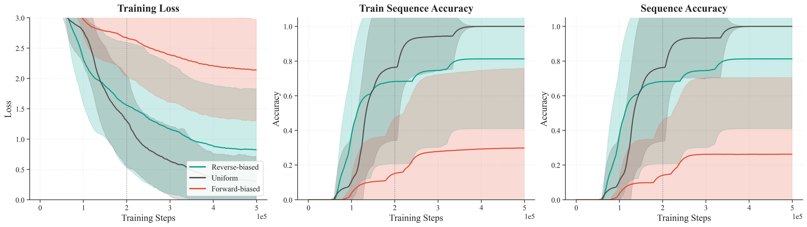

# icml2026-rebuttal
Repository for icml2026 rebuttal

### Observations

* Early Training: The reverse-oriented bias improves optimization in the early stages compared to the uniform baseline, while the forward-oriented bias suppresses it. This confirms that non-uniform masking can partially reduce early instability and aligns with the known asymmetry of path reasoning.

* Late Training & Convergence: The bias primarily alters the optimization trajectory rather than the capability ceiling. Around 200k steps, the uniform model catches up. Furthermore, strong directional bias can cause over-specialization, sometimes resulting in worse final convergence than the uniform baseline.
